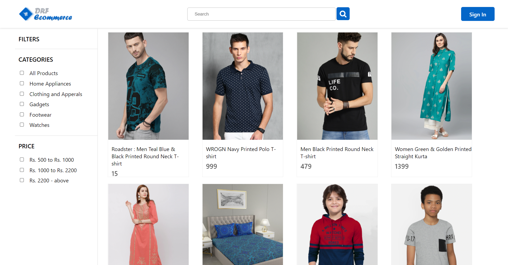
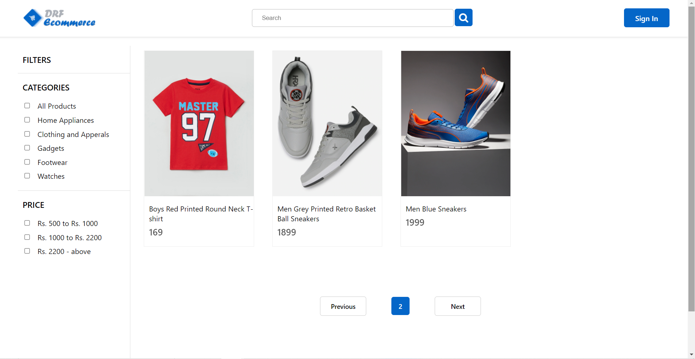
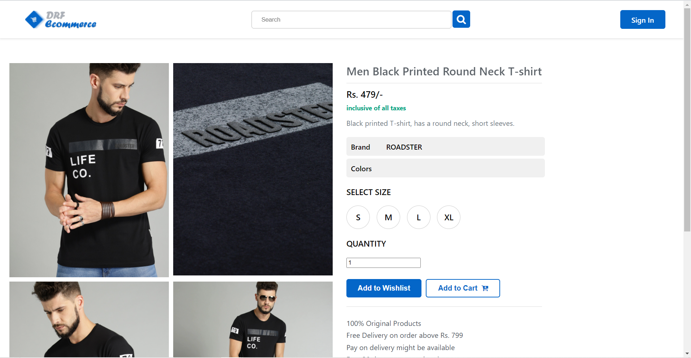
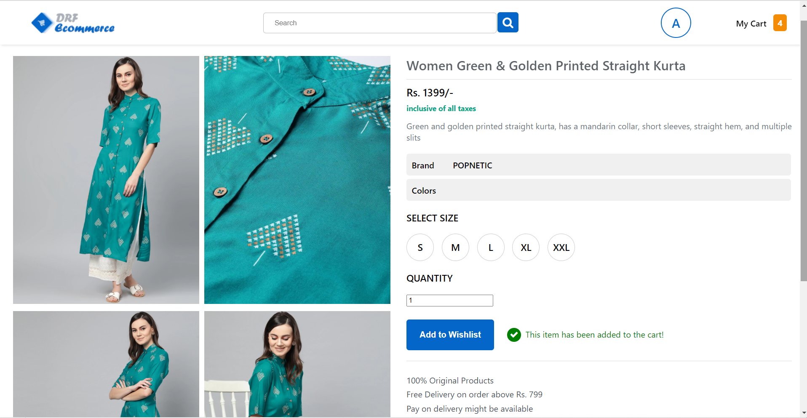
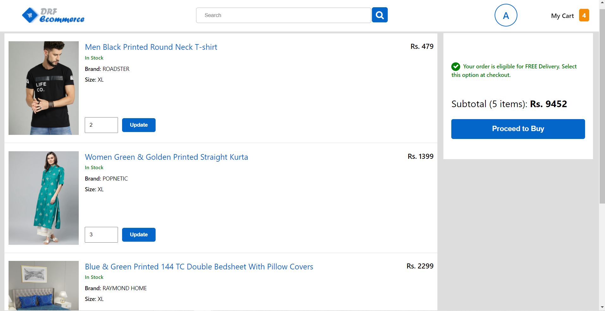

# DRF Ecommerce
 
DRF E-commerce is a fully functional *Clothing Ecommerce* Platform made using Django and React.


## Characteristic Features

*  View and buy clothing products.
*  Select from a wide variety of products, different color and sizes options.
*  Secure JWT Authentication for user safety and protected routes.
*  Cart functionality for saving products, updating their quantities and checking out of the store.
*  Searching and Filtering your product searched by categories, prices, etc.
*  Pagination feature for better user experience and decreased server load.


## Tech Stack Used
 
* [React.js](https://github.com/facebook/react "React.js + Hooks") is used for creating the UI.
    * [React's Context API](https://github.com/facebook/react "React's Context API") is used for managing complex state.
* [Django](https://www.djangoproject.com/ "Django") is used for the backend.
    * [Django Rest Framework](https://www.django-rest-framework.org/ "Django Rest Framework") is used for setting up API endpoints.
* [SQLite DB](https://sqlite.org/docs.html "SQLite DB") is used that comes bundled by default in the Django app.
* [React Router Dom](https://reactrouter.com/web "React Router Dom") is used for declarative routing in the browser.
* [Simple JWT](https://django-rest-framework-simplejwt.readthedocs.io/en/latest/ "Simple JWT") provides a JSON Web Token authentication backend for the Django REST Framework.
* [Pillow](https://pillow.readthedocs.io/en/stable/ "Pillow") library is used for extensive file support and image processing tasks.
* [Localstorage](https://developer.chrome.com/docs/devtools/storage/localstorage/ "Localstorage") used for storing user info like access tokens and session data in the browser storage.


## Prototype

**Product List View**


**Pagination**


**Product Detail View**


**Product Added to Cart**


**Cart View**



## What more can be done?
 
This project is far from perfect. Many more things can be done in order to make the user experience and the overall functioning of the product. These are some of the features that I believe could be added in the future:
 
* A product recommender system, that provides each user personalized recommendations according to their product searches.
* Mechanism for storing user tokens in *cookies*, as Localstorage is prone to **XSS (Cross-Site Scripting)** attacks.
* Integrating a NoSQL database(eg. MongoDB) for more flexibility in product detail fields.
 


## How to setup on a local machine?

To setup this projct on a local machine:

* Fork this repository.
* Clone the repository using simple zip download or use the command
    ```
        git clone https://github.com/{Your-Username}/Movie-Recommendation-System
    ```
* Create a virtual environment for the project
    ```
        pip install virtualenv
        for windows: virtualenv -p /usr/bin/python3 env_name
        for linux(ubuntu): virtualenv env_name
        
    ```
* Activate the Virtual environment
    ```
       source env_name/bin/activate
    ```
    Once the virtual environment is activated, the name of your virtual environment will appear on left side of terminal. This will let you know that the virtual environment is currently active. 

* Install all the dependencies
    ```
       pip install -r requirements.txt
    ```

* To start the  the developement server, run the command
    ```
        cd ./backend
        python manage.py runserver
    ```
* Installing the dependencies for frontend client
    ```
        cd ./client
        npm install
    ```    
* For viewing the app
    ```
        npm start
    ```

    Now at `localhost:3000`, you should see the app successfully running.